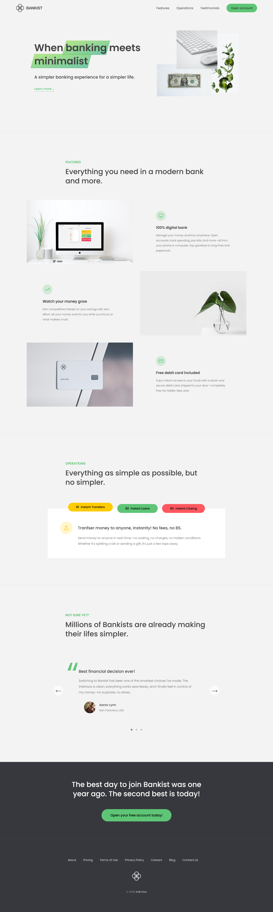
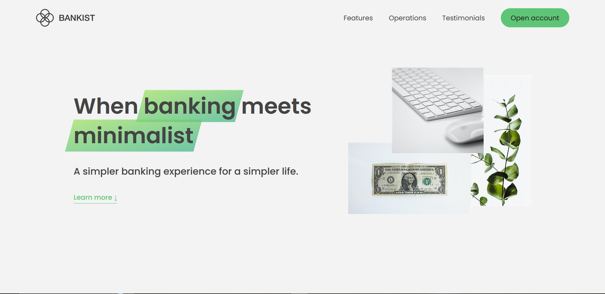
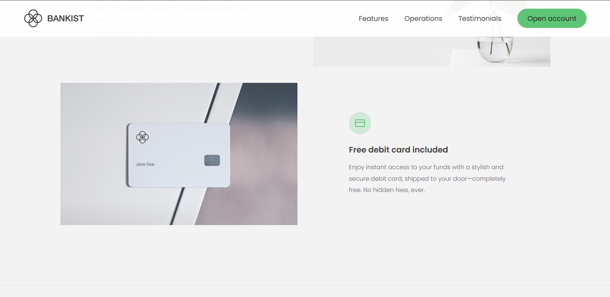
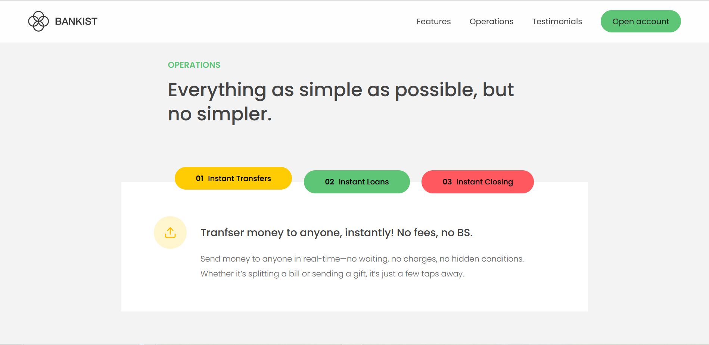
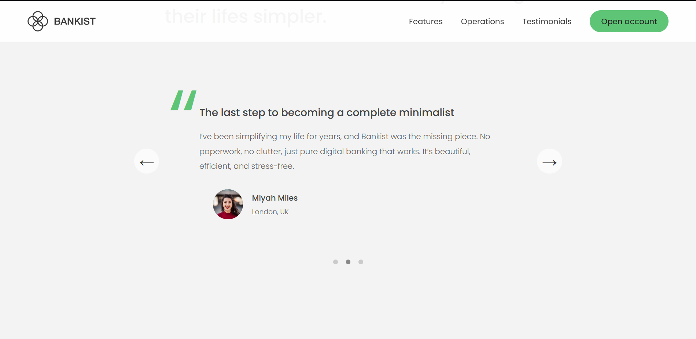
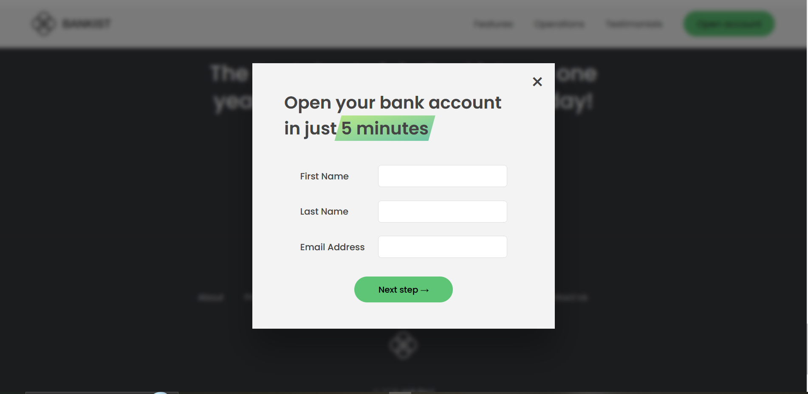

# 💰 Bankist – Modern Minimalist Banking

Bankist is a sleek, responsive, and modern banking landing page built with HTML5, CSS3, and JavaScript. Designed for simplicity, speed, and performance, Bankist offers a beautiful and minimal user experience that reflects the future of digital banking.

> “When banking meets minimalist.”

---

## 🖼️ Preview

---

## ✨ Features

### 🌟 Hero Section

A striking first impression with minimalist branding and a clear call to action.

### ⚙️ Features Section

Modern banking benefits explained with clean visuals.

- ✅ 100% digital banking experience.
- 📈 Grow your money with smart savings.
- 💳 Free debit card with every account.

### 🔄 Operations Section

Banking made simpler and faster.

- 💸 **Instant Transfers**: Send money to anyone instantly, with zero fees and zero hassle.
- 🏠 **Instant Loans**: Get quick access to funds for a home, trip, or personal goals—straight from your dashboard.
- ❌ **Instant Closing**: Done banking with us? Close your account in seconds with no paperwork.

### 💬 Testimonials

Real users sharing real experiences.

- “💚 Best financial decision ever. Bankist gave me complete control over my finances, with zero stress.” – Aaron Lynn
- “🎯 The last step to becoming a complete minimalist. Finally, a bank that matches my lifestyle.” – Jane Doe
- “🚀 Finally free from old-school banks. Bankist is refreshingly easy to use and genuinely helpful.” – John Smith

### 📝 Sign-Up Form

Encourages user interaction and sign-ups with a clean, simple design.

---

## ⚡ Performance & UX Optimizations

- 🧠 Built with **Vanilla JavaScript** to add interactivity and dynamic behaviors.
- 🖼️ **Optimized images** for faster loading and reduced bandwidth.
- 💤 **Lazy loading** implemented for images to enhance page speed and performance.

---

## 🛠️ Built With

- 
- 
- 

---

## 👨‍💻 Author

Made with ❤️ by [Anik Paul](https://paulanik.com)

---

## 📬 Contact

- 📧 **Email**: [hello@paulanik.com](mailto:hello@paulanik.com)
- 🌐 **Portfolio**: [paulanik.com](https://paulanik.com)
- 💼 **LinkedIn**: [LinkedIn Profile](https://www.linkedin.com/in/anik-paul-dev/)
- 📝 **Dev.to**: [Dev.to Profile](https://dev.to/anikpaul)

---

## 📄 License

This project is open source and available under the [MIT License](LICENSE).
